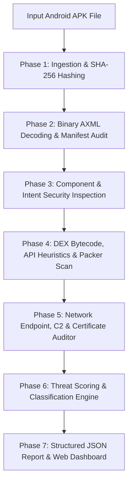

# 🛡️ APK Sentinel — Mobile Malware & Static Reverse-Engineering Engine

[](LICENSE)
[](https://www.python.org/)
[](tests/)
[](#-7-phase-analysis-pipeline)

**APK Sentinel** is an enterprise-grade, pure static analysis and reverse-engineering security engine designed for Android Application Packages (`.apk`). It analyzes Android manifests, component configurations, Dalvik/ART bytecode, embedded network endpoints, dynamic packers, and X.509 signature certificates without executing code on a live device.

The system features both a **Python CLI Engine** and a **Responsive Cyber-Themed Single-Page Web Dashboard** (`index.html`) equipped with step-by-step progress logging, an interactive risk score gauge, and instant threat simulation scenarios.

---

## 🌟 Key Highlights

- **Pure Static Analysis:** Zero code execution risk — inspects raw ZIP archives, binary Android XML (`AXML`), DEX bytecode string pools, and META-INF signatures.
- **7-Phase Heuristic Pipeline:** Systematic audit covering Manifest Permissions, Component Security, Bytecode API Heuristics, Network & C2 Endpoints, X.509 Certificates, Threat Scoring, and Report Generation.
- **Strict JSON Output Schema:** Conforms to a standardized JSON schema providing detailed risk breakdowns, confidence levels, critical findings, and remediation advice.
- **Dual-Input Responsive Web App:** Includes a desktop drag-and-drop zone and mobile-optimized touch file selector built with Tailwind CSS.
- **Instant Demo Scenarios:** Built-in threat profiles (Clean Utility, Anubis Banking Trojan, Pegasus Spyware) for immediate evaluation without requiring an external `.apk` file.

---

## 🏗️ 7-Phase Analysis Pipeline Architecture



### **Detailed Phase Breakdown:**

1. **Phase 1: Ingestion & Archive Unpacking ([ingestion.py](file:///d:/Github%20projects/apk-analyzer/apk_analyzer/ingestion.py))**
   - Validates `.apk` container integrity, computes file size and SHA-256 digest, extracts raw `AndroidManifest.xml`, `classes*.dex`, and `META-INF/` signature archives.
2. **Phase 2: Manifest & Permission Auditing ([manifest_auditor.py](file:///d:/Github%20projects/apk-analyzer/apk_analyzer/manifest_auditor.py))**
   - Decodes compiled binary XML via custom AXML parser ([axml.py](file:///d:/Github%20projects/apk-analyzer/apk_analyzer/axml.py)). Flags dangerous permissions (`RECEIVE_BOOT_COMPLETED`, `SYSTEM_ALERT_WINDOW`, `BIND_ACCESSIBILITY_SERVICE`) and dangerous permission pairings (Overlay trojans, Spyware exfiltration, SMS 2FA interception).
3. **Phase 3: Component & Intent Inspection ([component_inspector.py](file:///d:/Github%20projects/apk-analyzer/apk_analyzer/component_inspector.py))**
   - Enumerates Activities, Services, Receivers, and Content Providers. Flags exported components lacking protection permissions, unprotected boot receivers, and headless background architectures.
4. **Phase 4: Bytecode, API Calls & Obfuscation Analysis ([bytecode_analyzer.py](file:///d:/Github%20projects/apk-analyzer/apk_analyzer/bytecode_analyzer.py))**
   - Computes Shannon Bytecode Entropy ($H \in [0.0, 8.0]$). Detects commercial packers (Qihoo 360, Bangcle, Secneo, Legu, Ijiami, APKProtect). Extracts high-risk API invocations (`DexClassLoader`, `Runtime.exec`, reflection) and disguised asset containers.
5. **Phase 5: Network Endpoint & Certificate Validator ([network_cert_analyzer.py](file:///d:/Github%20projects/apk-analyzer/apk_analyzer/network_cert_analyzer.py))**
   - Extracts hardcoded URLs and IPv4 addresses. Flags unencrypted HTTP calls, raw IP C2 endpoints, dynamic DNS services (`duckdns`, `ngrok`, `no-ip`), data drop pastebins, and Telegram bot exfiltration channels. Inspects v1/v2/v3 signature schemes and debug certificates.
6. **Phase 6: Scoring & Classification Engine ([scoring_engine.py](file:///d:/Github%20projects/apk-analyzer/apk_analyzer/scoring_engine.py))**
   - Aggregates findings into a composite 0–100 Risk Score. Maps verdicts into threat tiers (`Safe` 0–39, `Suspicious` 40–69, `Malicious` 70–100) with confidence levels (`Low`, `Medium`, `High`).
7. **Phase 7: JSON Report Generator & CLI ([pipeline.py](file:///d:/Github%20projects/apk-analyzer/apk_analyzer/pipeline.py), [main.py](file:///d:/Github%20projects/apk-analyzer/main.py))**
   - Assembles and serializes validated JSON reports. Exposes full CLI and Web Interface output options.

---

## 🚀 Quick Start & Installation

### **1. Prerequisites**
- Python 3.10 or higher installed.

### **2. Clone & Setup**
```bash
git clone https://github.com/ShaktiMaurya27/apk-analyzer.git
cd apk-analyzer

# Create virtual environment (optional but recommended)
python -m venv venv
# On Windows:
venv\Scripts\activate
# On Linux/macOS:
source venv/bin/activate

# Install required lightweight dependencies
pip install pydantic
```

---

## 🖥️ Command Line Interface (CLI) Usage

Run static analysis on any `.apk` file using `main.py`:

```bash
# Print analysis report to console
python main.py path/to/sample.apk

# Export JSON analysis report to file
python main.py path/to/sample.apk -o output_report.json
```

---

## 🌐 Web Dashboard (APK Sentinel)

Launch the interactive single-page web dashboard by opening `index.html` in any modern web browser:

- **Desktop Drag & Drop:** Drop `.apk` files directly into the cyber-themed scanner dropzone.
- **Mobile Touch Selector:** Tap to open native device file picker.
- **Instant Demo Scenarios:** Test the system instantly using built-in threat profiles (Clean Utility, Anubis Banking Trojan, Pegasus Spyware).

---

## 🧪 Unit & Integration Testing

Run the full test suite covering all 7 phases:

```bash
python -m unittest discover tests
```

**Test Output:**
```text
..............
----------------------------------------------------------------------
Ran 14 tests in 0.183s

OK
```

---

## 📄 Output Schema Specification

All analysis reports adhere strictly to the following JSON format:

```json
{
  "app_metadata": {
    "package_name": "com.trojan.banker",
    "app_name": "BankerTrojan",
    "version_name": "1.0",
    "version_code": "1",
    "target_sdk": 28,
    "min_sdk": 19,
    "file_size_bytes": 1842900,
    "sha256": "7b8a9c0d1e2f3a4b5c6d7e8f9a0b1c2d3e4f5a6b7c8d9e0f1a2b3c4d5e6f7a8b"
  },
  "verdict": {
    "risk_score": 95,
    "classification": "Malicious",
    "confidence_level": "High",
    "summary": "Application classified as MALICIOUS with a Risk Score of 95/100."
  },
  "risk_breakdown": {
    "critical_findings": [
      {
        "category": "Permissions",
        "indicator": "Banking Trojan / Overlay Signature Pair",
        "description": "Application combines RECEIVE_BOOT_COMPLETED and SYSTEM_ALERT_WINDOW permissions.",
        "severity": "Critical"
      }
    ],
    "dangerous_permissions": [
      {
        "name": "android.permission.BIND_ACCESSIBILITY_SERVICE",
        "reason": "Grants complete control over user UI interaction."
      }
    ],
    "suspicious_apis_and_calls": [
      "dalvik.system.DexClassLoader",
      "java.lang.Runtime.exec"
    ],
    "extracted_endpoints": [
      "https://api.telegram.org/bot987654321/sendMessage"
    ],
    "obfuscation_and_packing": {
      "is_packed": true,
      "packer_detected": "Qihoo 360 Jiagu",
      "entropy_level": "Extremely High (7.8/8.0)"
    }
  },
  "recommendations": [
    "DO NOT INSTALL OR EXECUTE: Package poses an immediate security threat."
  ]
}
```

---

## 📚 Architectural Rationale

For a detailed breakdown of libraries used in this project and why specific external dependencies were chosen or intentionally excluded, see **[WHY.md](WHY.md)**.

---

## 📜 License

Distributed under the MIT License. See `LICENSE` for details.
