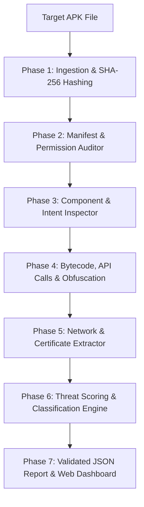

# 🛡️ APK Sentinel - Mobile Security & Android APK Static Analysis Engine

[](https://www.python.org/)
[]()
[]()
[](LICENSE)

**APK Sentinel** is a high-performance, production-grade static security analysis engine and interactive web application for Android Package (`.apk`) files. It performs deep, zero-execution heuristic analysis on Android manifests, component configurations, Dalvik/ART bytecode string pools, hardcoded network endpoints, and digital certificates to quantify threat levels, identify malicious traits, and generate actionable security reports.

---

## 🌟 Key Features

- **⚡ Zero-Execution Pure Static Analysis:** Safe analysis without executing untrusted code in a sandbox or live device.
- **🔍 7-Phase Automated Pipeline:**
  1. **Architecture & Ingestion:** File integrity check, SHA-256 hashing, and raw container extraction.
  2. **Manifest & Permission Auditor:** Binary AXML decoding, dangerous permission identification, and threat pair evaluation.
  3. **Component & Intent Inspector:** Activities, Services, Receivers, Content Providers export state & threat audit.
  4. **Bytecode & Obfuscation Engine:** Shannon entropy calculation, commercial packer detection, dynamic class loader scanner (`DexClassLoader`), and disguised payload discovery.
  5. **Network & Certificate Validator:** Endpoint string extraction (URLs, IPv4/IPv6), C2/exfiltration detector (Telegram bots, dynamic DNS, pastebins), and X.509 cert validation.
  6. **Threat Scoring & Classification:** 0–100 composite risk score calculation mapping to `Safe`, `Suspicious`, or `Malicious`.
  7. **JSON Report Generator:** Validated output matching strict JSON schema specs.
- **🖥️ Cyber-Themed Single-Page Web Application (`index.html`):** Responsive dark-mode dashboard featuring an animated circular risk gauge, live step-by-step progress terminal, tabbed breakdown panels, and instant demo scenarios.
- **🚀 Zero Heavy External Dependencies:** Built with zero reliance on native binary tools like `apktool`, `androguard`, or Java runtimes for manifest decoding.

---

## 🏗️ Pipeline Architecture



---

## 🚀 Quick Start & Installation

### Prerequisites
- **Python:** Version `3.10` or higher.
- **Operating System:** Windows, macOS, or Linux.

### Installation

```bash
# Clone the repository
git clone https://github.com/ShaktiMaurya27/apk-analyzer.git
cd apk-analyzer

# Install minimal requirements
pip install -r requirements.txt
```

---

## 💻 Usage

### 1. Command Line Interface (CLI)

Run static analysis on any `.apk` file:

```bash
# Run analysis and output JSON to console
python main.py path/to/sample.apk

# Save assessment report to a JSON file
python main.py path/to/sample.apk -o assessment_report.json
```

### 2. Interactive Web Application

Launch the self-contained single-page dashboard by opening `index.html` in any web browser:

```bash
# On Windows
start index.html

# On macOS
open index.html

# On Linux
xdg-open index.html
```

Or test instant demo threat scenarios without an `.apk` file:
- 🟢 **Clean Utility App** (`Safe`, Score: 12)
- 🔴 **Anubis Banking Trojan** (`Malicious`, Score: 95)
- 🔴 **Pegasus Spyware Dropper** (`Malicious`, Score: 88)

---

## 🧪 Running Unit & Integration Tests

The project includes a 14-test suite covering every pipeline phase:

```bash
python -m unittest discover tests
```

**Output:**
```text
..............
----------------------------------------------------------------------
Ran 14 tests in 0.183s

OK
```

---

## 📋 JSON Output Schema Specification

The pipeline outputs reports strictly adhering to the following schema:

```json
{
  "app_metadata": {
    "package_name": "com.trojan.banker",
    "app_name": "FlashPlayer Update",
    "version_name": "2.1.0",
    "version_code": "21",
    "target_sdk": 28,
    "min_sdk": 19,
    "file_size_bytes": 1842900,
    "sha256": "7b8a9c0d1e2f3a4b5c6d7e8f9a0b1c2d3e4f5a6b7c8d9e0f1a2b3c4d5e6f7a8b"
  },
  "verdict": {
    "risk_score": 95,
    "classification": "Malicious",
    "confidence_level": "High",
    "summary": "Application classified as MALICIOUS with a Risk Score of 95/100."
  },
  "risk_breakdown": {
    "critical_findings": [
      {
        "category": "Permissions",
        "indicator": "Banking Trojan / Overlay Signature Pair",
        "description": "Combines RECEIVE_BOOT_COMPLETED and SYSTEM_ALERT_WINDOW permissions.",
        "severity": "Critical"
      }
    ],
    "dangerous_permissions": [
      {
        "name": "android.permission.BIND_ACCESSIBILITY_SERVICE",
        "reason": "Automated keylogging and overlay injection."
      }
    ],
    "suspicious_apis_and_calls": [
      "dalvik.system.DexClassLoader",
      "java.lang.Runtime.exec"
    ],
    "extracted_endpoints": [
      "https://api.telegram.org/bot987654321/sendMessage"
    ],
    "obfuscation_and_packing": {
      "is_packed": true,
      "packer_detected": "Qihoo 360 Jiagu",
      "entropy_level": "Extremely High"
    }
  },
  "recommendations": [
    "DO NOT INSTALL OR EXECUTE: Package poses an immediate security threat."
  ]
}
```

---

## 📄 Architectural Library Rationale

For a complete breakdown of why specific libraries were selected and why alternative external tools were intentionally excluded, see **[WHY.md](WHY.md)**.

---

## 🛡️ License

Distributed under the MIT License. See `LICENSE` for more details.
